# Cppcheck-Misra手册

**Version 0.13**

## 介绍

该工具基于cppcheck及misra-c2012插件提供代码静态检测。

* 提供misra命令，以文件，模块，项目为单位进行检测。

* 基于`git commit`​进行增量检查。**本工具基于git-hooks，如果已经使用其它git-hooks，请阅读第4部分，防止会对已有的git-hooks产生影响。**

如果检测到Misra规则定义的错误，会在项目根目录生成html文件，查看此文件可以错误方便定位。

* 使用需要阅读0.1. 2.3.5章节，如果使用了git-hook,还需要阅读第4章节。
* 工具的开发维护需要阅读第6、7章节。

## 0.Quick Start

```bash
// 1.解压&安装
// windos和linux有不同的安装方式，具体安装过程请参考第1章
// linux的快速安装，windows请参考第1章
python install.py
// 2.检测安装

misra -h

// 3.使用
// 下面有不同的检测方式，根据需要选择
// 检测生成的结果见生成的文件夹check_results中，其中
// cppcheck.xml 为原始的结果文件
// misra.xml 为过滤后的结果文件，过滤出有效的misra结果
// html为对应的可视化网页
// 3.1 全量检测
// 在路径下(.为当前路径)以及子路径中寻找build_commands.json，并开始检测，如果项目的编译方式不是cmkae，应该使用--module

misra --project . 

// 3.2 模块检测
// 也可以检测多个文件，不需要文件build_commands.json，会寻找include或inc文件夹作为cppcheck相关子命令的值，include/inc不强制

misra --module . 

// 3.3 文件检测
// 适合单文件检测

misra --file a.c

// 3.4 增量检测
// 3.4.1 (每个项目都需要)加载配置，在具体的根目录下

misra --install_hook

// 3.4.2 增加提交代码
 
git add Yourcodes

// 3.4.3 提交代码，自动触发增量检测
// 增量检测会多一步过滤，过滤出改动行的错误

git commit

// 4. 项目中卸载配置

misra --uninstall_hook

// 5. 卸载工具

misra --uninstall_misra
```

## 1.工具的安装

### 1.1 Linux下安装

#### 1.1.1. 解压安装包`cppcheck_misra.zip`​，进入得到的`cppcheck_misra`​.

确保系统中有python3，并确定调用python3的命令为`python`​还是`python3`​.

> 解释：公司一些项目依赖python2，因此环境中的`python`​命令实际上对应的是python2，而本工具依赖的是python3

#### 1.1.2 安装python3

确保安装了python3版本>=3.7

#### 1.1.3 安装Git

部分功能依赖git，如果环境中没有git，请预先安装git继续执行。

#### 1.1.4 安装依赖

```bash
pip3 --install -r requirement.txt
```

#### 1.1.5 运行install.py

在安装包路径下执行:

```bash
python3 install.py --path $YourPath$
```

此命令将会安装到`path/cppcheck`​路径下。

或默认安装到`~/.local/cppcheck`​

```bash
python3 install.py
```

**安装完成，按照提醒增加环境变量**

​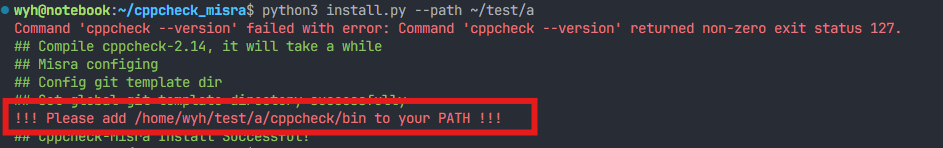​

根据提示，将提示中的路径加入到环境变量PATH中。在`~/.bashrc`​中修改环境变量PATH。

​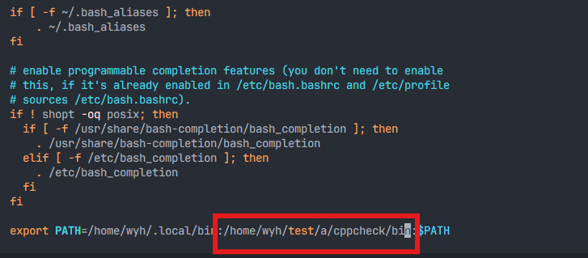​

重新加载环境变量

​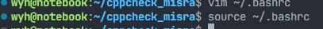​

```bash
source ~/.bashrc
```

#### 1.1.6 验证

检测安装是否成功，在任意位置打开命令行执行`misra -h`​，显示如下信息则说明安装成功。

​​

‍

### 1.2 Windows下安装

#### 1.2.1. 解压安装包`cppcheck_misra.zip`​，进入得到的`cppcheck_misra`​.

#### 1.2.2. 安装`cppcheck-2.16.0-x64-Setup.msi`​

请按照以下步骤操作。

* 点击next

  ​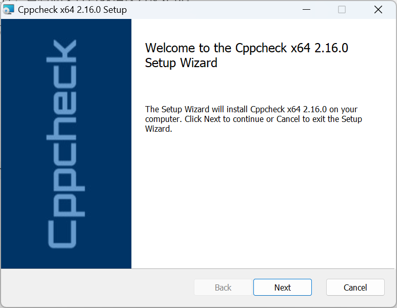​
* 修改安装路径

  注意：<span data-type="text" style="background-color: var(--b3-card-error-background); color: var(--b3-card-error-color);">一定不要使用默认的安装路径</span>`C:\Program Files`​，请选择一个<span data-type="text" style="background-color: var(--b3-card-error-background); color: var(--b3-card-error-color);">没有空格</span>的安装路径。否则工具遇到有空格的路径无法正常工作。<span data-type="text" style="background-color: var(--b3-card-error-background); color: var(--b3-card-error-color);">必须安装在</span>`*/cppcheck/`​​，如`D:\cppcheck`​。

  点击`Browse`​选择安装路径。

  ​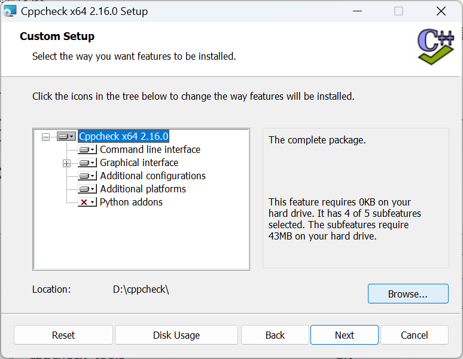​

  新建文件夹`cppcheck`​，必须选择`cppcheck`​为安装路径。推荐安装路径`D:\cppcheck`​

  ​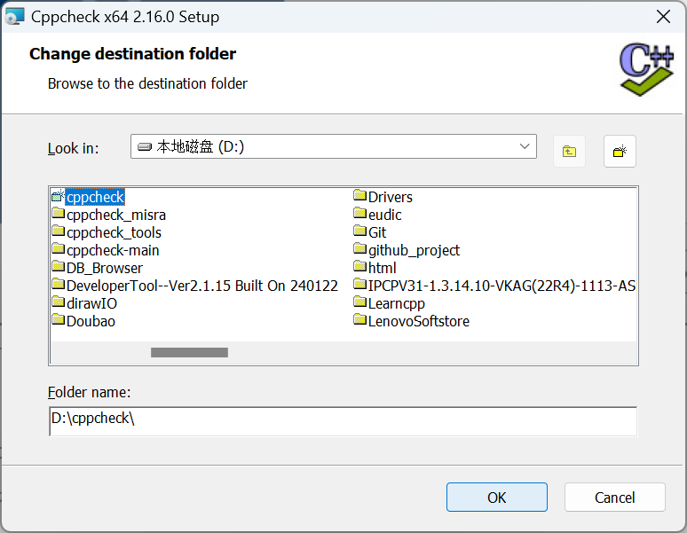​
* 选择插件。之后一直往下点击直到安装成功。

  ​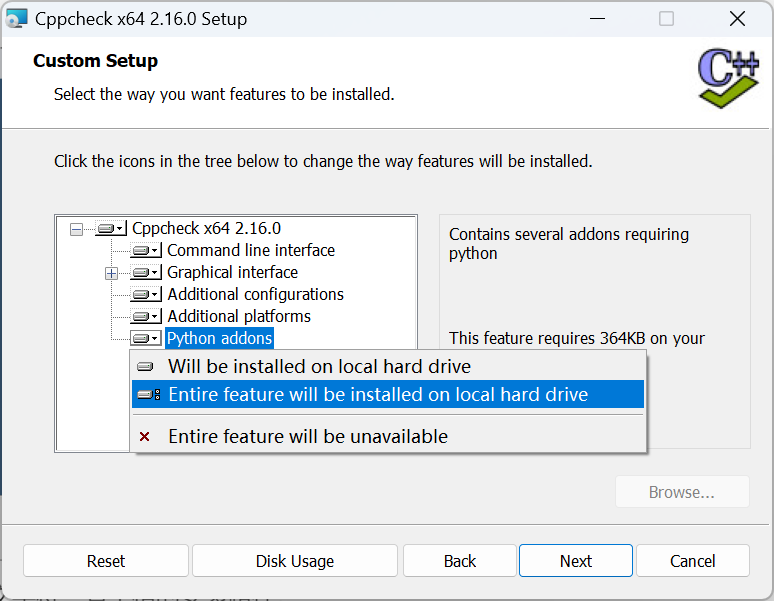​
* 添加环境变量，将安装目录添加到环境变量PATH

  ​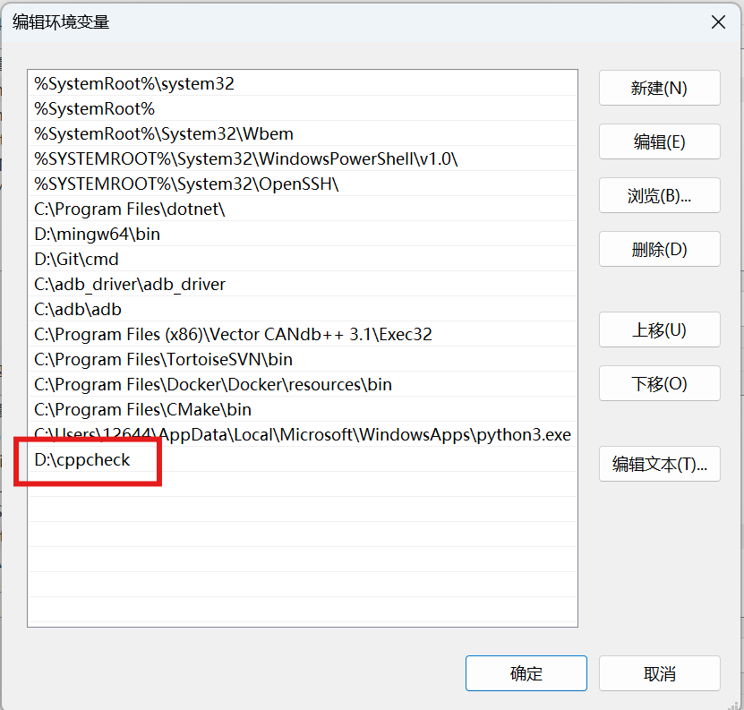​
* 测试安装是否成功

  在任意位置打开命令行执行`cppcheck --version`​

  ​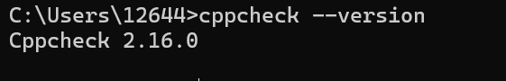​

#### 1.2.3 安装依赖

```c
pip3 --install -r requirement.txt 
```

#### 1.2.4 安装Git

部分功能依赖git，如果环境中没有git，请预先安装git后继续执行。

#### 1.2.5 运行`install_win.py`​

请在安装脚本的路径下运行`install_win.py`​。运行命令：

```bash
python install_win.py --path [cppcheck_path]
```

cppcheck_path为上一步中cppcheck安装的路径。如

​`python install_win.py --path D:\cppcheck`​

#### 1.2.6 验证

检测安装是否成功，在任意位置打开命令行执行`misra -h`​，显示如下信息则说明安装成功。

​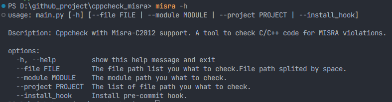​

## 2.工具的配置 （非必要）

### 2.增加检测文件的类型

本工具仅检查指定类型的文件。支持的文件类型写在`$YourInstallPath$/cppcheck/misra/config.yaml`​。

请添加自己需要检测的代码文件后缀到此配置文件中。

默认格式如下：

​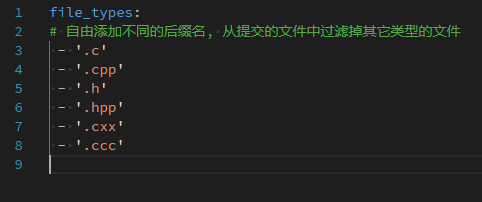​

## 3. 工具的使用说明

工具有两种使用方式：

* misra命令工具：通过misra命令来检查文件/模块/项目。
* git commit：在提交时自动检查发生改动的行的misra错误。

### 3.1 misra命令

|参数及用例|描述|用例（解释）|
| :-------------------------------------------------| :--------------------------------------------------------------------------------------------| :------------------------------------------------------------------------------------------------|
|-h,--help|显示帮助信息|1.misra -h|
|--file [file_list] <br />|对file_list中的文件进行检查<br />|1.misra --file a.c （对a.c进行检查）|
|||2.misra --file "a.cpp b.cpp c.cpp" （对多个文件进行检查，文件列表用“”包含，文件间用空格分开）|
|--module [path]<br />|对路径下的所有文件进行检查，可以为相对路径，也可以为绝对路径。<br />|1. misra --module . （对当前路径进行检查）|
|||2.misra --module src/XCall (对路径src/XCall进行检查)|
|--project [path]<br />|对路径下的所有文件进行检查，可以为相对路径，也可以为绝对路径。<br />|1.misra --project  . （对当前路径进行检查）|
|||2.misra --project src/XCall (对路径src/XCall进行检查)|
|--install_hook|安装git hook以支持增量检查。必须在项目的根目录下执行该命令。|1.misra --install_hook|
|--uninstall_hook|卸载上一条命令安装的hook|1.misra --uninstall_hook|
|--uninstall_misra|仅支持Linux，卸载该工具。Windows可以使用执行windows安装程序卸载。|1.misra --uninstall_misra|

### 3.2 Git commit

通过安装git hook在执行`git commit`​时进行增量检查：仅检查改动行发生的问题。

1. 在项目的根目录下，执行

```c
misra --install_hook
```

注意每个项目仅需要执行一次。

2. 修改代码，依次执行 `git add`​   ` git commit`​触发检查。

    ```c
    git add 
    git commit 
    ```

    执行`git commit`​会触发检查。输出如下图所示。

    ​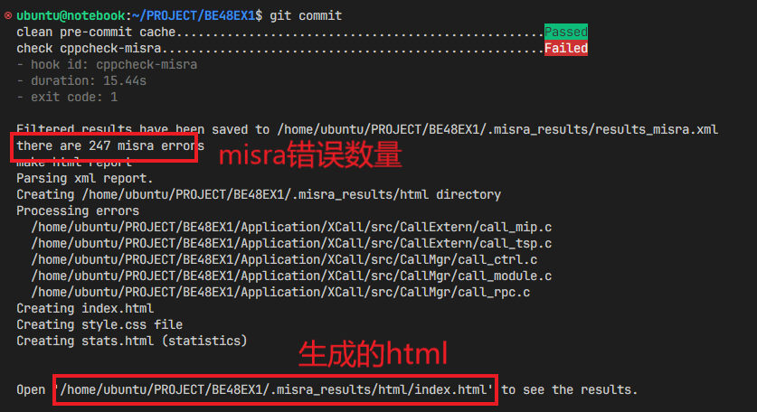​

> 如图，`git commit`​执行后会执行两个hook。
>
> 第一个hook清除了pre-commit的缓存，它总是会成功。
>
> 第二个hook执行cppcheck。图中显示此次检测没有通过，说明有错误，需要查看html。
>
> 如果没有检测到misra错误，`git commit`​执行成功。否则失败。

### 3.3 查看检测结果

#### 3.3.1 check_result的结构。

注意：在windows下安装无`*_html`​子文件夹。windows的结果可以依靠图形工具查看。

​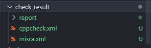​

* cppcheck.xml：cppcheck根据misra的检测结果，包含非misra的结果。
* misra.xml：经过cppcheck.xml过滤，仅包含misra错误的结果。
* cppcheck_html: cppcheck.xml结果可视化网页
* misra_html：misra.xml结果可视化网页

#### 3.3.2 index.html (for Linux)

​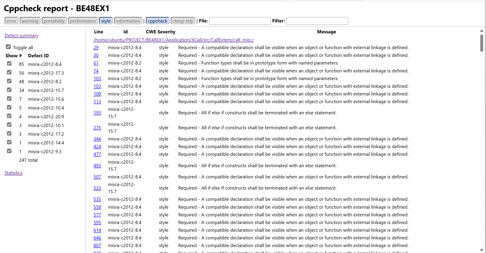​

可以根据**左侧导航栏**看到错误规则和行数，请根据misra规则进行更改。

​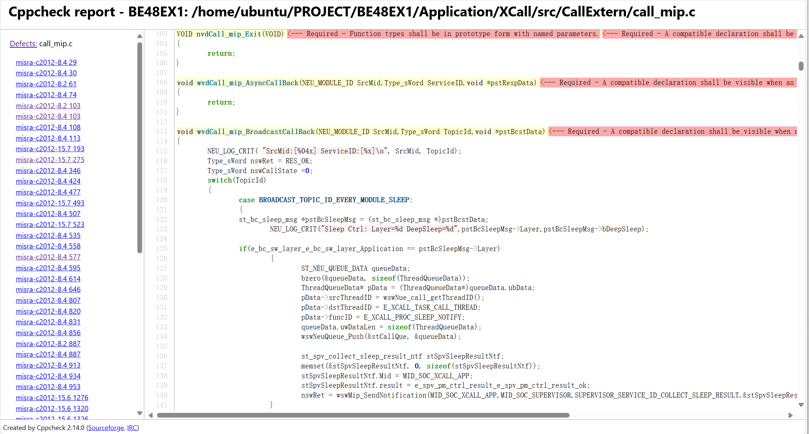​

#### 3.3.3 使用可视化工具 (for Windows)

打开安装位置下cppcheck的图形工具。

​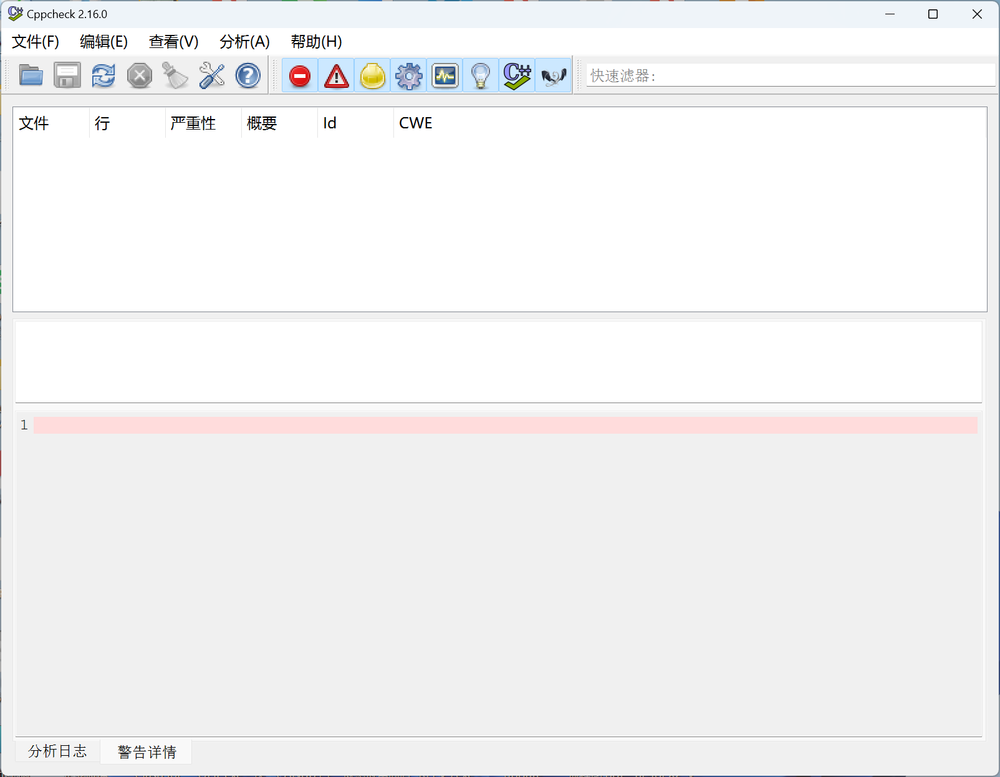​

加载生成的misra.xml文件。

​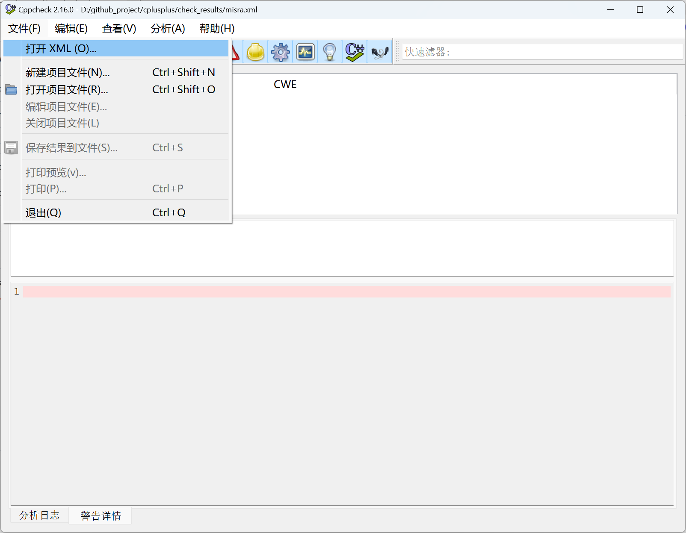​

​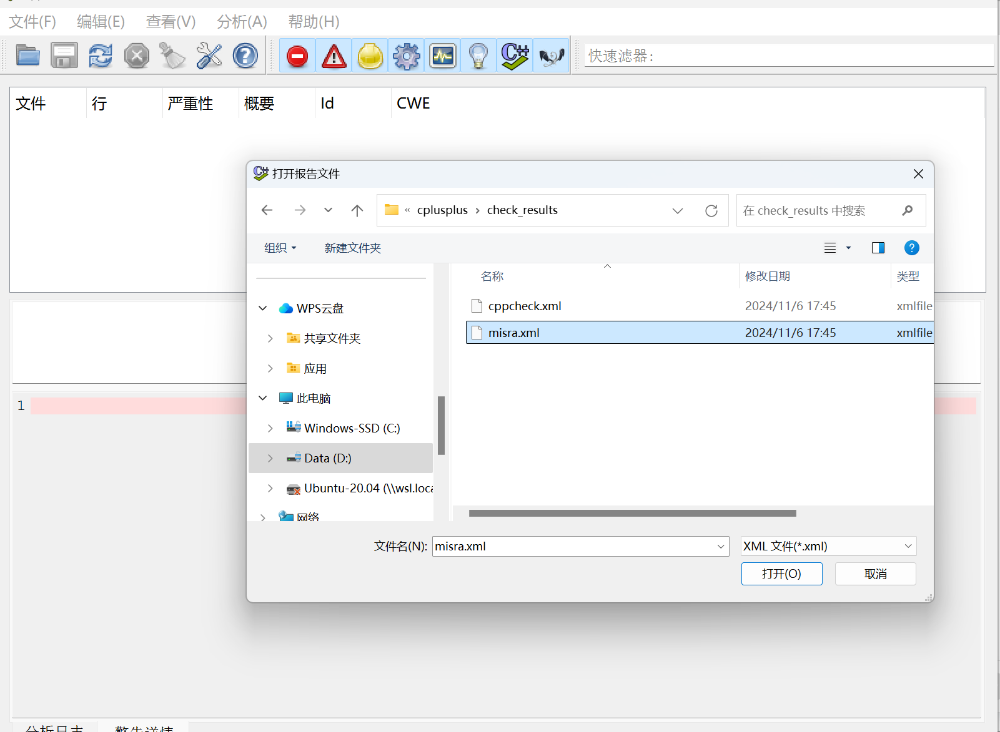​

​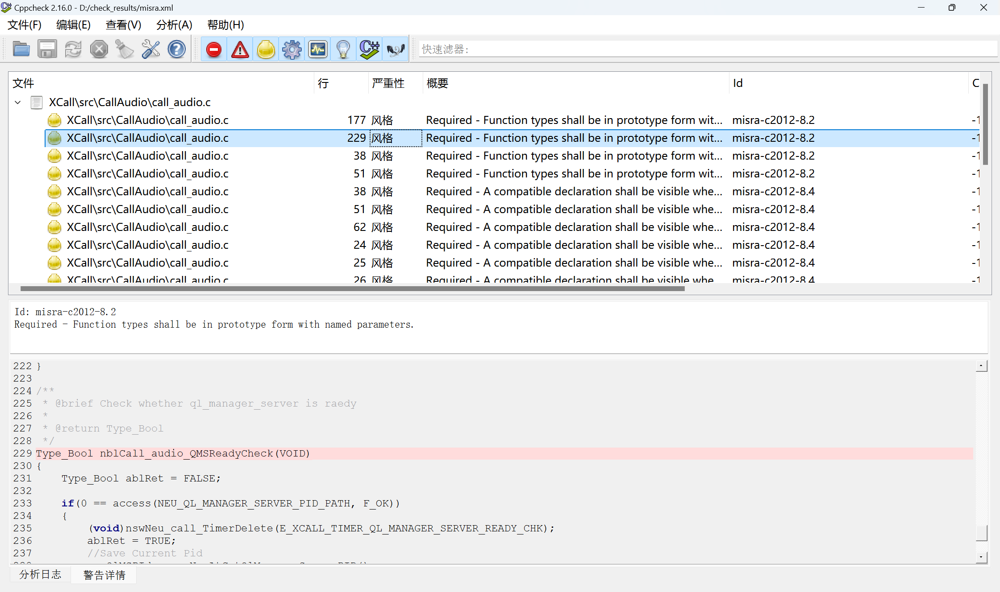​

## 4. 如果你已经使用了git-hook（未使用请无视本条目）

本工具使用[pre-commit](https://pre-commit.com/)框架。在执行命令`misra --install_hook`​时，会修改hooks。

**建议使用pre-commit统一管理hooks**，修改$HOME/.local/cppcheck/misra下的build_commit.sh和.pre-commit-config.yaml，添加自己的hooks。

**已有git-hook时，安装pre-commit框架会保存git-hook，并在卸载pre-commit时恢复之前的git-hook。**

## 5. 解决错误

### 5.1 资料

一般的错误可以通过修改代码解决，这里提供了一些资料以供查阅：

* 中文版规则 M2M_MISRAC 2012编码规范_V1.0.pdf(见安装目录)

* 规则速查，中文版 [MISRA C-2012中文版](https://www.canfd.net/misra.html)
* 规则解读，浓缩版 [【MISRA-C 2012】浓缩版解读_misra2012 文档-CSDN博客](https://blog.csdn.net/Hxj_CSDN/article/details/134539827)
* 规则解读 [MISRA C:2012 嵌入式C规范解读 | 普通人](https://hjk.life/posts/misra-c-2012/)

### 5.2 排查错误及修改

下面给一个简单例子说明。（有时候错误的原因比例子中的更加隐蔽、复杂。）

浏览错误，第182行的misra-17.3。

​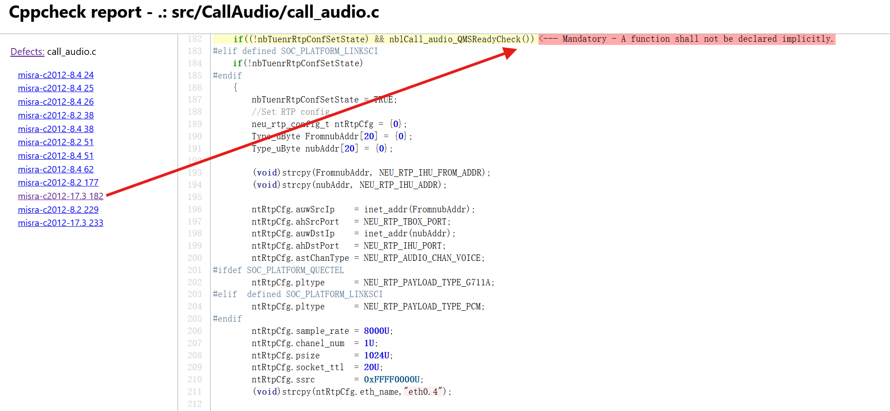​

查看规则17.3的说明，规则17.3的内容是：函数不能隐式声明，必须在使用之前有声明。

​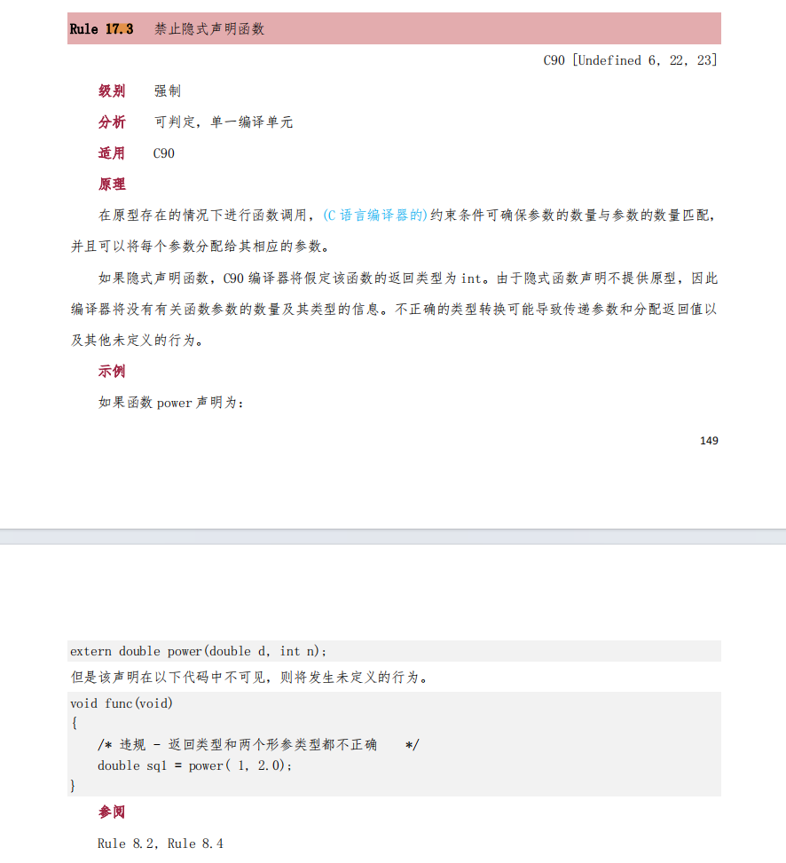​

查看源文件，发现出现错误的行数182中，函数调用`nblCall_audio_QMSReadyCheck()`​在头文件中无声明，在182行之前无声明，定义出现在后面的229行，符合规则介绍中的解释。

​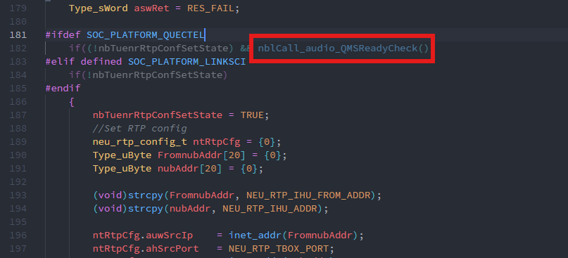​

​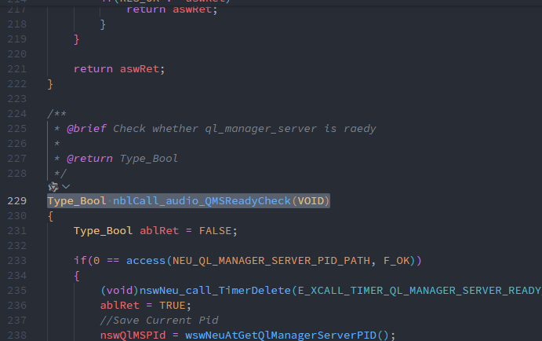​

在头文件中加入该函数声明即可解决错误。

### 5.3 屏蔽错误

有时候出现错误可能是项目使用的框架的问题，可能和历史代码有关。也有可能是检测工具误报：已经符合规则了但就是不正确。

总之这里需要一个方法在计无可施时通过检测，不产生错误。

根据情况有两个方法可以选择：

* 在规则文件中屏蔽某个规则。一些错误可能和采用的框架有关，比如说有规则不允许使用<stdio.h>头文件。通过商议，应该把该规则添加到`$HOME/.local/cppcheck/misra/suppress.txt`​中屏蔽。具体的形式可以参考suppress.txt文件中用法。
* 对顽固的错误，可以采用最后的方法：行内屏蔽。cppcheck提供了行内屏蔽的方法，即可以通过添加注释而检测某个规则的错误。`$HOME/.local/cppcheck/misra/inline_suppress.py`​可以根据过滤结果给代码添加行内注释。**不应该滥用这种方法，它会给代码中添加注释，降低代码的可读性。**

‍

## 6. 工具的运行逻辑（对工具的开发者和维护者）

### 6.1 安装包文件介绍

​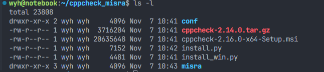​

‍

介绍：

* conf：包含在安装时配置的文件。在安装时读取文件内容，替换其中的路径，新内容复制到misra文件中。

  例如`conf/misra.sh.in`​在执行安装会被替换其中两个占位字符串:`PYTHON_EXE`​和`REPLACE_MEE`​.

  ​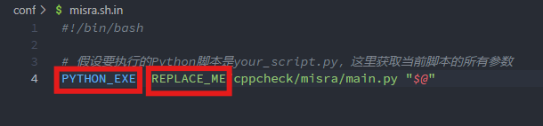​

* cppcheck-2.14.0.tar.gz                    cppcheck的安装包（不需要改动，only for Linux）
* cppcheck-2.16.0-x64-Setup.msi     cppcheck的安装包（不需要改动，包含图形工具，only for Windows）
* install.py                                         Linux安装脚本
* install_win.py                                  Windows安装脚本

* 配置文件，目前只包含一个关于misra规则的配置文件。

* misra相关的文件/脚本，包含misra规则的描述，屏蔽的规则文件，处理脚本等。

### 6.2 运行流程

#### 6.2.1 安装脚本的执行流程

略

#### 6.2.2 misra命令的执行流程

1. misra本身是一个misra.bat（for Windows）/ misra.sh （for Linux）脚本文件，其调用了`cppcheck/misra/main.py`​
2. ​`main.py`​根据命令行参数执行检测哪种检测。每个检测都是单独的一个函数。目前支持文件、模块、项目。

#### 6.2.3 pre commit的执行流程

1. 我们使用pre-commit框架，其中.pre-commit-conf.yaml文件为其配置文件。pre-commit框架不仅有pre-commit，还有多种git的hook。配置可以指定每个hook的阶段。详情见官网。

2. 在项目根目录执行build_commit命令，会将.pre-commit-conf.yaml从`$HOME/.local/cppcheck/misra`​复制到当前目录并将其中的hook安装到当前项目根目录的.`git/hook`​文件夹下。

3. 执行git commit，触发hooks，执行检测。
4. pre-commit.py首先获取当前项目的根目录，从yaml文件加载需要检查的文件类型，获取文件的改动点。

    返回的改动点是一个GitDiffInfo类的列表，其声明如下

    ```python
    class GitDiffInfo:
        def __init__(self, filename):
            self.filename = filename	# 文件名
            self.is_new_file = False # 本次commit新增的文件
            self.changes = []	# 改动点列表 一个改动点如[45,1]表示，该文件45行开始，以及之后的一行，是本次提交的改动部分。一个文件有若干改动点。
    ```

    改动点列表读取自`git diff -U0`​命令的输出，如`@@ -69,0 +70,2 @@`​。该结果的意思为：旧文件的69行开始以及之后的0行，对应新文件70行开始以及之后的2行。我们不关心旧文件，只关心新文件不同之处，即70行，71行，72行。这个改动点就是[70，2]。改动点列表的保持方式与`git diff`​中的形式相同。
5. 运行cppcheck并过滤结果。在运行cppcheck的前后都要进行过滤。

    * 首先在检测前只留下发生改动、且后缀符合**file_types.yaml**描述的文件。

    * 执行cppcheck，cppcheck的最小检测单元是文件。可以打印生成的cppcheck命令帮助调试。
    * **检测后有两次过滤。第一次仅留下关于misra的检测结果，第二次仅留下关于改动行的misra错误。**
    * 执行cppcheck-htmlreport，生成关于最终结果的html文件。

## 7. 开发记录

### 7.1 开发日志

|Date|VERSION|DESCRIPTION|Author(Email)|
| ------------| ---------| ----------------------------------------------------------------------------------------------------------------------------| ----------------------------|
|2024/11/07|0.10|第一版，基础功能发布，编写说明文档。|yuhang.wang@m2motive.com<br />|
|2024/11/02|0.11|增加misra命令：安装hook、卸载hook、Linux下卸载。将linux下的cppcheck版本从2.14替换为2.16|yuhang.wang@m2motive.com|
|2025/01/16|0.12|1.增加新的hook，在执行git-commit时增加字段标志此次提交经过cppcheck检测。2.输出cppcheck检测过程的输出，方便得知检测的进度。|yuhang.wang@m2motive.com|
|2025/01/20|0.13|修复东风、柳汽项目上的编码错误的问题|yuhang.wang@m2motive.com|

### 7.2 TODO

#### 7.2.1 Plan

* [ ] 增加功能：通过添加文件列表
* [ ] 支持不同的屏蔽规则，可以通过选择不同的配置文件实现

#### 7.2.2 DOING

‍

#### 7.2.3DONE

* [X] hook的安装、卸载
* [X] 整个工具的卸载
* [X] 自动检测用户环境下python3和python。避免手动替换
* [X] 修复增量检测的bug
* [X] 已知问题：Linux下在安装包路径下安装不会解压。
* [X] 修改增量提交策略：有错误仍可以提交，添加[CPPCHECK]标记

‍
